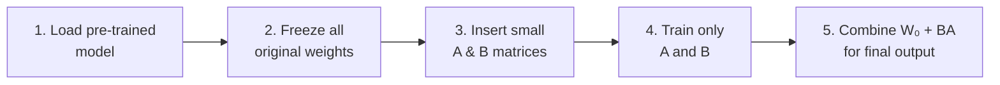
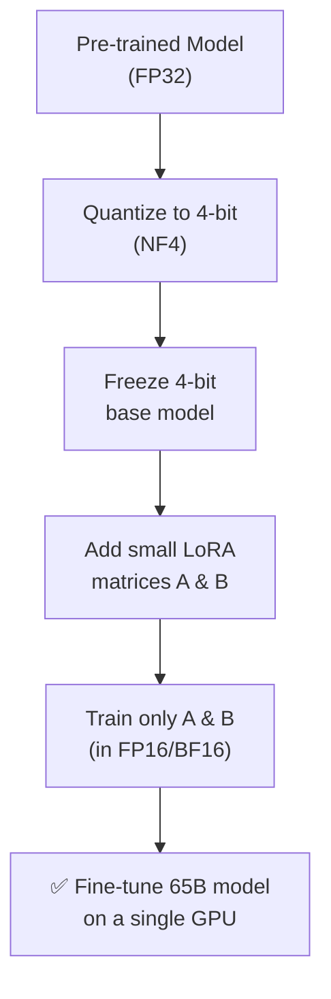

### Step-by-Step Flow



---

## 5. QLoRA (Quantized LoRA)

### Simple Idea
**QLoRA = Quantization + LoRA**



**Why it's powerful:** You can fine-tune **huge models** (even 65B parameters) on **one GPU** — impossible with full fine-tuning.

---

## 6. LoRA vs QLoRA — Quick Comparison

| Feature | LoRA | QLoRA |
|---|---|---|
| Base model size | Normal (16/32-bit) | Very small (4-bit) |
| Memory needed | Medium | Very Low |
| Speed | Faster | Slightly Slower |
| Best for | Medium GPUs | Very limited GPUs |

---

## 7. Hands-On: Fine-Tuning with LoRA

**Step 1 — Install libraries**
```bash
pip install transformers peft accelerate datasets bitsandbytes
```

**Step 2 — Load model**
```python
from transformers import AutoModelForCausalLM, AutoTokenizer

model_name = "meta-llama/Llama-3.1-8B"

tokenizer = AutoTokenizer.from_pretrained(model_name)
model = AutoModelForCausalLM.from_pretrained(model_name)
```

**Step 3 — Add LoRA**
```python
from peft import LoraConfig, get_peft_model, TaskType

lora_config = LoraConfig(
    task_type=TaskType.CAUSAL_LM,
    r=8,                    # rank (size of A & B)
    lora_alpha=16,          # scaling factor
    lora_dropout=0.05,
    target_modules=["q_proj", "v_proj"],
    bias="none",
)

model = get_peft_model(model, lora_config)
model.print_trainable_parameters()
```

**Step 4 — Load dataset**
```python
from datasets import load_dataset

dataset = load_dataset("your_dataset_name")

def tokenize_fn(example):
    return tokenizer(example["text"], truncation=True, max_length=512)

tokenized_dataset = dataset.map(tokenize_fn, batched=True)
```

**Step 5 — Train**
```python
from transformers import TrainingArguments, Trainer

training_args = TrainingArguments(
    output_dir="./lora-model",
    per_device_train_batch_size=4,
    num_train_epochs=3,
    learning_rate=2e-4,
    fp16=True,
)

trainer = Trainer(
    model=model,
    args=training_args,
    train_dataset=tokenized_dataset["train"],
)

trainer.train()
```

**Step 6 — Save**
```python
model.save_pretrained("./lora-adapters")
```

---

## 8. Hands-On: Fine-Tuning with QLoRA

**Step 1 — Load model in 4-bit**
```python
import torch
from transformers import AutoModelForCausalLM, AutoTokenizer, BitsAndBytesConfig

bnb_config = BitsAndBytesConfig(
    load_in_4bit=True,
    bnb_4bit_quant_type="nf4",
    bnb_4bit_compute_dtype=torch.bfloat16,
    bnb_4bit_use_double_quant=True,
)

tokenizer = AutoTokenizer.from_pretrained("meta-llama/Llama-3.1-8B")
model = AutoModelForCausalLM.from_pretrained(
    "meta-llama/Llama-3.1-8B",
    quantization_config=bnb_config,
    device_map="auto",
)
```

**Step 2 — Prepare model for training**
```python
from peft import prepare_model_for_kbit_training

model = prepare_model_for_kbit_training(model)
```

**Step 3 — Add LoRA**
```python
from peft import LoraConfig, get_peft_model, TaskType

lora_config = LoraConfig(
    task_type=TaskType.CAUSAL_LM,
    r=16,
    lora_alpha=32,
    lora_dropout=0.05,
    target_modules=["q_proj", "v_proj", "k_proj", "o_proj"],
    bias="none",
)

model = get_peft_model(model, lora_config)
```

**Step 4 — Train** — same as LoRA Step 4-5 above

**Step 5 — Merge adapters (optional, for deployment)**
```python
merged_model = model.merge_and_unload()
merged_model.save_pretrained("./qlora-merged-model")
```

---

## 9. Quick Summary

| Term | One-Line Meaning |
|---|---|
| **Quantization** | Store weights in fewer bits → smaller, faster, slightly less accurate |
| **Full Fine-Tuning** | Update all weights → best accuracy, needs huge resources |
| **LoRA** | Freeze weights, train small A×B matrices → cheap & fast |
| **QLoRA** | LoRA + 4-bit quantized base → fine-tune huge models on small GPUs |

---

*References: LoRA — Hu et al., 2021 | QLoRA — Dettmers et al., 2023*
