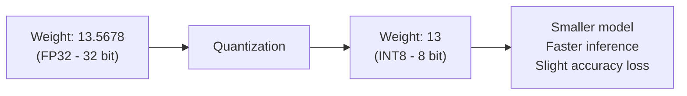
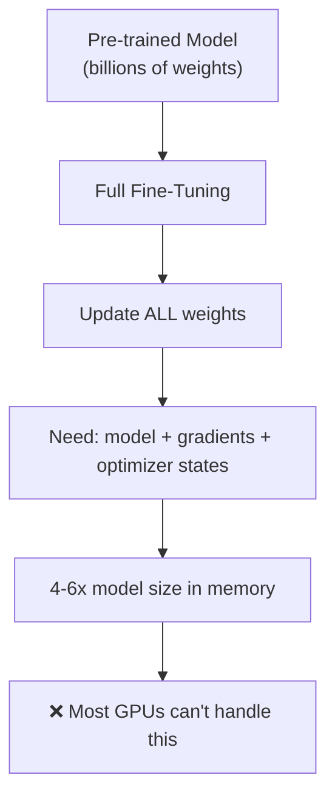
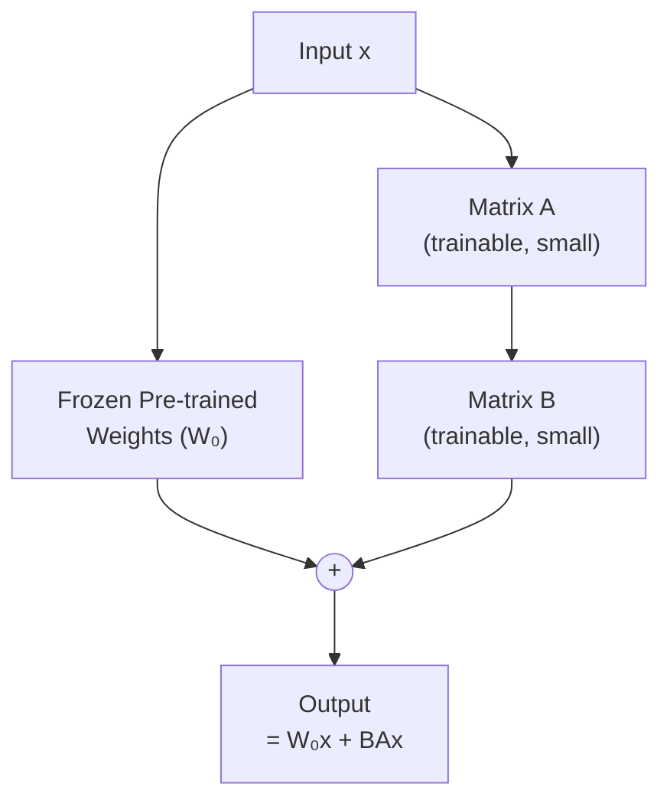
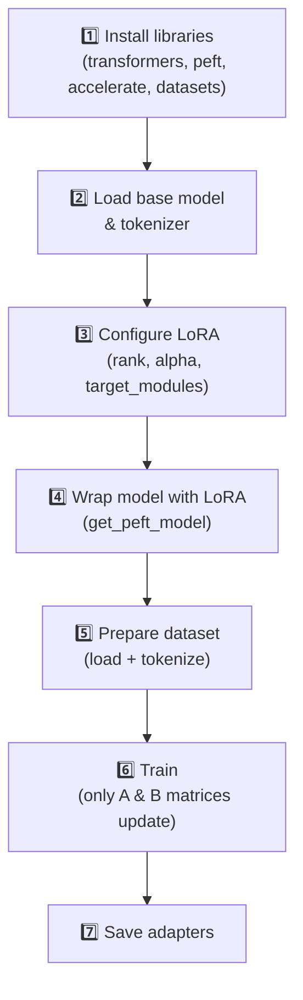
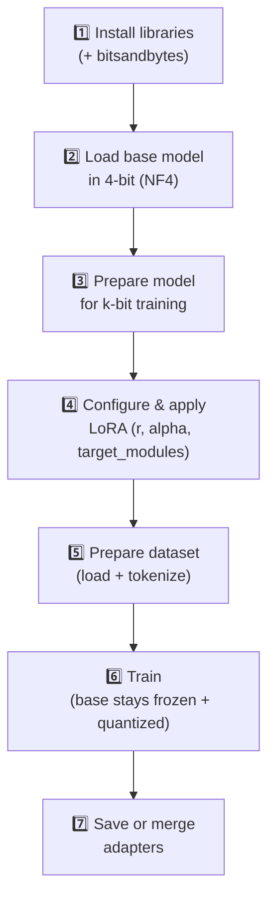

# LoRA & QLoRA — Fine-Tuning LLMs 

## 1. What is Quantization?

When we train a neural network, the most important thing it learns is its **parameters** (also called **weights**).

Normally, these weights are stored using **32-bit floating point numbers (FP32)** — called **full precision**.

**Problem:** Big models have billions of parameters. Storing all in FP32 needs huge GPU memory and disk space.

**Solution: Quantization** — convert weights from FP32 (32-bit) to a smaller format like **INT8 (8-bit)** or **INT4 (4-bit)**. Model becomes smaller and faster.

> Think of it like compressing a photo — file size goes down, quality drops slightly.

---

## 2. What is Fine-Tuning?

**Fine-tuning** = taking an already-trained model and training it a bit more on new data so it becomes good at a specific job.

| Type | What it means | Example |
|---|---|---|
| **Domain-specific** | Teach the model a specific field | Fine-tune on medical textbooks → model understands medical terms |
| **Task-specific** | Teach the model one job | Fine-tune only for sentiment analysis (positive/negative) |

---

## 3. Full Fine-Tuning — and Why It's Hard

**Full fine-tuning** = update **every single weight** in the model.

**Two big problems:**
1. Every weight must be updated → billions of calculations
2. Hardware limits → not enough GPU memory

👉 This is why **LoRA** and **QLoRA** exist.

---

## 4. LoRA (Low-Rank Adaptation)

### Simple Idea
- **Freeze** the original weights (don't touch them)
- Add **two small new matrices (A and B)** that learn the "change" needed
- Only train A and B

### Why It Saves Resources — Example

A weight matrix of size **4096 × 4096** = ~16.7 million numbers.

| Method | Trainable Parameters |
|---|---|
| Full fine-tuning | 16,777,216 (100%) |
| LoRA (rank = 8) | 65,536 (**~0.4%**) |

## 🔧 Steps to Fine-Tune a Model

### Using LoRA

| Step | Action |
|---|---|
| 1 | Install `transformers`, `peft`, `accelerate`, `datasets` |
| 2 | Load the pre-trained model and tokenizer from HuggingFace |
| 3 | Define `LoraConfig` — set rank (`r`), `lora_alpha`, `dropout`, `target_modules` |
| 4 | Apply `get_peft_model()` — freezes original weights, inserts trainable A & B matrices |
| 5 | Load and tokenize your training dataset |
| 6 | Run `Trainer` with `TrainingArguments` — only A & B matrices are updated |
| 7 | Save the LoRA adapters (not the full model) with `model.save_pretrained()` |

---

### Using QLoRA

| Step | Action |
|---|---|
| 1 | Install `transformers`, `peft`, `accelerate`, `datasets`, `bitsandbytes` |
| 2 | Load base model in 4-bit using `BitsAndBytesConfig` (`load_in_4bit=True`, `nf4`, double quant) |
| 3 | Call `prepare_model_for_kbit_training()` to stabilize the quantized model for training |
| 4 | Define `LoraConfig` and apply `get_peft_model()` — same as LoRA |
| 5 | Load and tokenize your training dataset |
| 6 | Run `Trainer` — only A & B matrices update; base model stays frozen and quantized |
| 7 | Save adapters, or run `merge_and_unload()` to bake LoRA into a deployable model |

> **Key difference:** QLoRA adds one extra step — loading the base model in 4-bit — before the LoRA setup. Everything else is the same.
